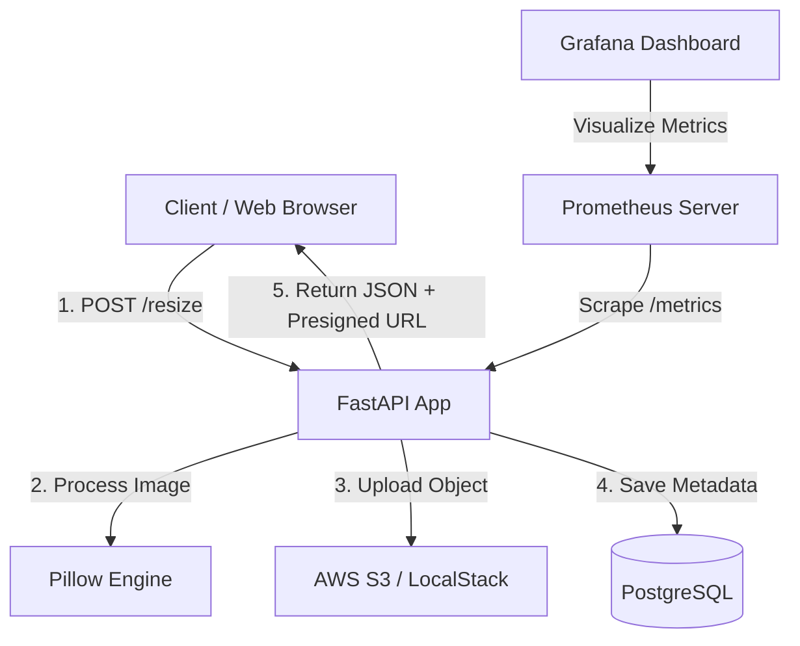

# 🚀 Cloud-Native Image Resizing Microservice

[](https://fastapi.tiangolo.com)
[](https://www.docker.com)
[](https://kubernetes.io)
[](https://prometheus.io)
[](https://grafana.com)
[](https://playwright.dev)
[](https://github.com/features/actions)

A fully containerized, asynchronous, cloud-native image resizing microservice designed with modern **Test Engineering** principles. This project serves as a comprehensive case study for building robust cloud architectures verified through unit, integration, end-to-end (E2E) browser automation, API integration, and load testing pipelines.

Developed under the course **"Test Engineering in Cloud Architectures"** at Marmara University.

---

## 🏗️ System Architecture

The microservice receives image files, resizes them asynchronously according to client-defined constraints, uploads the resulting object to AWS S3 (simulated locally using LocalStack), saves transaction metadata to a PostgreSQL database, and returns a secure temporary **Presigned GET URL** for downloading the resized asset.

### System Data Flow



---

## ⚡ Key Features

* **Asynchronous Execution:** Built on FastAPI and Uvicorn for non-blocking I/O operations.
* **Storage Isolation:** Clean separation of concerns by storing binary objects in S3 and metadata in PostgreSQL.
* **Local Cloud Simulation:** Uses `LocalStack` to mimic AWS S3 offline, eliminating cloud costs during dev/test.
* **Robust Test Pyramid:**
  * **Unit Tests:** Business logic, schemas, and Pillow image processing boundaries.
  * **Integration Tests:** Database CRUD operations, S3 upload/deletion lifecycle, and endpoint mocks.
  * **E2E Browser Tests:** Automated UI workflows using Playwright.
* **API Integration Tests:** Automated Postman collection execution using Newman.
* **Stress & Performance Testing:** Stresstest scripts written in k6 verifying RPS and P95 latency.
* **Observability Stack:** Custom Prometheus metrics scraper coupled with an auto-provisioned Grafana monitoring dashboard.
* **CI/CD Pipeline:** Fully automated GitHub Actions workflow enforcing Ruff linting, test suites, Docker build validation, Newman tests, and smoke health checks.

---

## 📂 Repository Structure

```text
├── app/                      # FastAPI Application Source Code
│   ├── database.py           # Database connection & Sessionmaker
│   ├── main.py               # Main application entrypoint & API Endpoints
│   ├── metrics.py            # Prometheus custom metrics declaration
│   ├── models.py             # SQLAlchemy Database Models
│   ├── schemas.py            # Pydantic Schemas (Request/Response validation)
│   └── services.py           # Core Business Logic (ImageResizeService & S3Service)
├── docs/                     # Academic Final Report, Video & Architecture Diagram
├── k8s/                      # Kubernetes deployment & service manifests
├── monitoring/               # Prometheus & Grafana configuration files
├── performance/              # k6 stress testing scripts
├── postman/                  # Postman collection & environment for Newman
├── tests/                    # Comprehensive test suite
│   ├── unit/                 # Unit tests (schemas, resize logic)
│   ├── integration/          # Integration tests (DB, S3 client, API)
│   └── e2e/                  # Playwright browser automation tests
├── ui/                       # Frontend web dashboard (HTML, CSS, JS)
├── docker-compose.yml        # Multi-container orchestration environment
├── Dockerfile                # Multi-stage optimized production Dockerfile
└── pytest.ini                # Pytest framework configuration settings
```

---

## 🚀 Getting Started

### Prerequisites
* Docker & Docker Compose installed.
* Python 3.11+ (if running tests locally outside Docker).

### Run Locally (Docker Compose)
To spin up the entire application along with PostgreSQL, LocalStack S3, Prometheus, and Grafana, simply run:

```bash
docker compose up -d
```

### Access Ports & Services
* 🖥️ **Web Application UI:** [http://localhost:8000](http://localhost:8000)
* 📖 **Swagger API Docs:** [http://localhost:8000/docs](http://localhost:8000/docs)
* 📊 **Grafana Dashboard:** [http://localhost:13000](http://localhost:13000) (Login: `admin` / `admin`)
* 📈 **Prometheus UI:** [http://localhost:9090](http://localhost:9090)
* ☁️ **LocalStack S3 Bucket:** [http://localhost:4566/image-resize-bucket](http://localhost:4566/image-resize-bucket)

---

## 🧪 Testing Guide

To run unit, integration, and E2E tests, first initialize your local virtual environment:

```bash
python3 -m venv venv
source venv/bin/activate
pip install -r requirements-dev.txt
```

### 1. Run Unit & Integration Tests (Pytest)
Ensure Docker Compose is running in the background (as integration tests require Postgres and LocalStack), then execute:

```bash
PYTHONPATH=. pytest tests/unit tests/integration --cov=app --cov-fail-under=70 -v
```
*(Enforces a minimum test coverage check of 70%. Current project coverage is **%76**).*

### 2. Run End-to-End (E2E) Browser Tests (Playwright)
Install Playwright browser binaries first, then run E2E browser tests:

```bash
playwright install
PYTHONPATH=. pytest tests/e2e/test_playwright.py --no-cov -v
```

### 3. Run API Tests (Newman)
Execute Postman integration collection tests using Newman:

```bash
npx newman run postman/collection.json --env-var baseUrl=http://localhost:8000
```

### 4. Run Load Tests (k6)
Run k6 stress tests simulating high concurrency:

```bash
docker run --rm -v $(pwd):/app -w /app --network=host grafana/k6 run performance/k6_script.js
```

---

## ☸️ Kubernetes Deployment

Deploy the microservice cluster locally using Minikube:

```bash
# Start Minikube
minikube start

# Mount shell to Minikube's Docker daemon
eval $(minikube docker-env)

# Build the local Docker image inside Minikube
docker build -t image-resize-service:latest .

# Apply Kubernetes manifests
kubectl apply -f k8s/

# Expose the service port
minikube service image-resize-service
```

---

## 👥 Contributors

* **Developer:** Arif Küçükeşmekaya
* **Advisor:** Dr. Öğr. Üyesi Büşra Ayaksız
* **University:** Marmara University, Faculty of Engineering, Department of Computer Engineering
