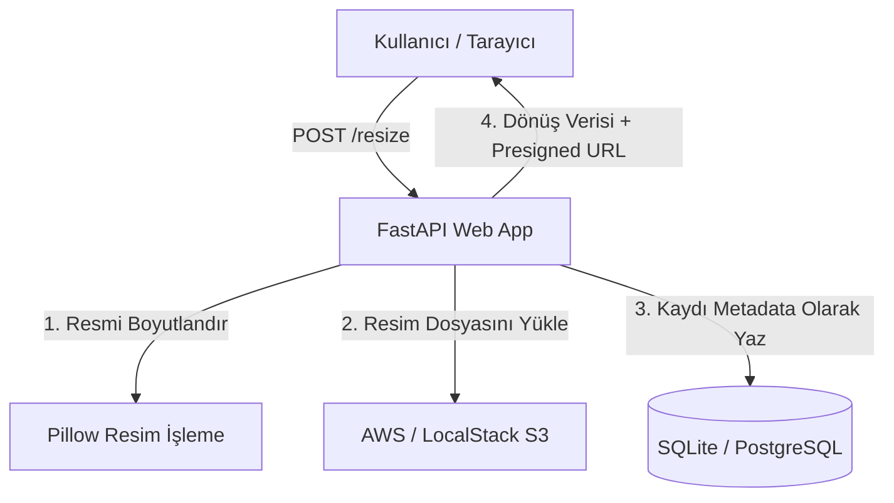

<!-- Bu dosya: Proje dokümantasyonu, mimari diyagramı ve hızlı başlangıç kılavuzu -->
# Image Resize Service

## Proje Özeti
FastAPI tabanlı mikroservis. Resim yükle → Pillow ile boyutlandır → LocalStack S3'e kaydet.
"Bulut Mimarilerinde Test Mühendisliği" dersi dönem projesidir.

## Mimari
Aşağıdaki Mermaid şemasında projenin çalışma prensipleri gösterilmiştir:



## Hızlı Başlangıç
```bash
git clone <repo>
cd image-resize-service
cp .env.example .env
docker compose up -d
# → http://localhost:8000/docs  (FastAPI Swagger UI)
# → http://localhost:13000      (Grafana — admin/admin)
# → http://localhost:9090       (Prometheus)
```

## Testleri Çalıştır
```bash
pip install -r requirements-dev.txt
pytest tests/unit tests/integration -v          # Hızlı testler
pytest tests/ -v                                 # Tüm testler (yavaş)
pytest --cov=app --cov-report=html               # Coverage raporu
```

## Performans Testi
```bash
k6 run performance/k6_script.js
```

## Kubernetes (Minikube)
```bash
minikube start
eval $(minikube docker-env)
docker build -t image-resize-service:latest .
kubectl apply -f k8s/
minikube service image-resize-service
```

## API Endpoint'leri
| Method | Path | Açıklama |
|--------|------|----------|
| `POST` | `/resize` | Resim yükle ve boyutlandır |
| `GET` | `/images` | Tüm kayıtları listele |
| `GET` | `/images/{id}` | Tek kayıt + presigned URL |
| `DELETE` | `/images/{id}` | Kaydı ve S3'teki dosyayı sil |
| `GET` | `/health` | Sağlık kontrolü |
| `GET` | `/metrics` | Prometheus metrikleri |

## Teknik Yığın
- **Servis:** FastAPI + Uvicorn
- **Resim İşleme:** Pillow
- **Veritabanı:** SQLite (dev) / PostgreSQL (prod) + SQLAlchemy
- **Depolama:** AWS S3 — LocalStack ile simüle edilir
- **Test:** Pytest + moto + Testcontainers + Playwright
- **CI/CD:** GitHub Actions
- **İzleme:** Prometheus + Grafana
- **Performans:** k6
- **Container:** Docker (multi-stage) + Docker Compose
- **Orkestrasyon:** Kubernetes (Minikube)
