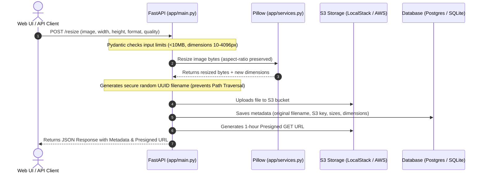

# Project Deep Dive & LLM Context Reference Manual

This document provides a complete, line-by-line, architectural, and operational reference of the **Image Resize Service** developed for the **Test Engineering in Cloud Architectures** course. 

Use this file to feed directly into any Large Language Model (LLM) to get instant, highly accurate answers to any questions regarding the system's design, code, tests, configurations, or operations.

---

## 🏛️ 1. Project Overview & Architectural Goals

The **Image Resize Service** is a containerized, cloud-native microservice built on FastAPI. It handles resizing uploaded images while maintaining their aspect ratio, storing them securely in AWS S3, and logging metadata in a relational database.

### 🔄 The Life of a Resize Request:


---

## 🛠️ 2. Core Technology Stack & Choice Justifications

| Component | Technology | Purpose | Justification |
| :--- | :--- | :--- | :--- |
| **Framework** | FastAPI (Python) | Web API Routing & Middleware | High performance, asynchronous (async/await) engine, automatic Swagger documentation generation, native Pydantic validation. |
| **Image Processing** | Pillow (PIL) | Scaling & Format Conversion | Industry-standard, mature Python library. Used for memory-safe bytes manipulation without disk I/O. |
| **Database ORM** | SQLAlchemy | Data Access Layer | Decouples code from database engines. Allows switching between local SQLite and production PostgreSQL via environment variables. |
| **Cloud Simulation** | LocalStack | AWS S3 Emulation | Emulates a fully S3-compliant API locally on port `4566`, eliminating AWS account requirements during local runs. |
| **Unit Mocking** | Moto | AWS SDK Mocking | Intercepts `boto3` calls globally in Python unit/integration tests to mock S3 in memory (RAM), ensuring sub-second test execution. |
| **E2E Testing** | Playwright | Browser Automation | Automates Chrome/Chromium to test UI elements, forms, and network requests, confirming real-world functionality. |
| **Performance Testing** | k6 (by Grafana) | Load Testing | Extremely lightweight Go-based engine with JS scenarios. Simulates concurrent users to test scaling limits. |
| **Observability** | Prometheus & Grafana | Monitoring under load | Collects custom latency, throughput, and error counters to measure system behavior under stress. |

---

## 📂 3. File-by-File Breakdown & Inner Workings

### 🐍 3.1. Backend Application (`app/`)

#### 📄 [app/database.py](file:///home/arif/projects2/test-engineering-in-cloud-architectures-project/image-resize-service/app/database.py)
* **Purpose:** Sets up database connections, pooling, and Session generation.
* **Key Elements:**
  * Reads `DATABASE_URL` env var (defaults to local SQLite `sqlite:///./dev.db`).
  * Handles thread-safety for SQLite using `connect_args={"check_same_thread": False}`.
  * Exports `get_db()` dependency generator which yields a session and ensures it closes in a `finally` block to prevent connection leaks.

#### 📄 [app/models.py](file:///home/arif/projects2/test-engineering-in-cloud-architectures-project/image-resize-service/app/models.py)
* **Purpose:** Defines the SQLAlchemy ORM schema.
* **Key Elements:**
  * `ImageRecord` class inherits from `Base`.
  * Fields: `id` (Primary Key), `original_filename` (string), `s3_bucket` (string), `s3_key` (string), `resized_width` (integer), `resized_height` (integer), `file_size_bytes` (integer), `created_at` (datetime with UTC default).

#### 📄 [app/schemas.py](file:///home/arif/projects2/test-engineering-in-cloud-architectures-project/image-resize-service/app/schemas.py)
* **Purpose:** Holds Pydantic models for data validation.
* **Key Elements:**
  * `ResizeRequest`: Validates target size (`width` and `height` between `10` and `4096`), `quality` (`1` to `100`), and `format` (JPEG, PNG, WEBP).
  * `ImageResponse`: Standardizes JSON outputs, including `presigned_url` which is dynamically added at request time. Supports ORM parsing.

#### 📄 [app/services.py](file:///home/arif/projects2/test-engineering-in-cloud-architectures-project/image-resize-service/app/services.py)
* **Purpose:** Implements pillow image manipulation and S3 API connections.
* **Key Classes:**
  * `ImageResizeService.resize(...)`: Takes raw bytes, opens them via `io.BytesIO`, uses `img.thumbnail((width, height))` to downscale preserving aspect ratio, converts transparent images (RGBA) to RGB if target is JPEG, and returns output bytes.
  * `S3Service`: Wrapper around `boto3.client("s3")`. Dynamically fetches the client using `@property` so that Moto mock context managers can intercept S3 creation during unit tests.
  * `S3Service.generate_presigned_url(...)`: Generates a temporary GET URL. Replaces `localstack:4566` with `localhost:4566` to ensure the host machine's browser can resolve the domain without hosts file edits.

#### 📄 [app/metrics.py](file:///home/arif/projects2/test-engineering-in-cloud-architectures-project/image-resize-service/app/metrics.py)
* **Purpose:** Defines custom Prometheus metrics.
* **Key Elements:**
  * `HTTP_REQUESTS_TOTAL` (Counter): Tracks request methods, paths, and status codes.
  * `HTTP_REQUEST_DURATION` (Histogram): Measures API response times.
  * `RESIZE_TOTAL` (Counter): Tracks the format and status (success/fail) of resize tasks.

#### 📄 [app/main.py](file:///home/arif/projects2/test-engineering-in-cloud-architectures-project/image-resize-service/app/main.py)
* **Purpose:** App entry point, routing, exception handling, and Prometheus scraping.
* **Key Elements:**
  * Sets up FastAPI middlewares (e.g., custom file size check to reject uploads $> 10\text{MB}$ before loading them into memory).
  * Serves frontend assets by mounting the `ui` directory statically on `/`.
  * `lifespan`: Startup handler that pre-creates the DB tables and ensures the default S3 bucket exists.
  * `/resize` (POST): Accepts file upload, calls `ImageResizeService` and `S3Service`, writes to DB, increments Prometheus counters, and returns metadata.
  * `/images` (GET): Paginated metadata list with freshly generated presigned URLs.
  * `/images/{image_id}` (DELETE): Deletes the file from S3, deletes metadata from DB, and returns HTTP 204.

---

### 🧪 3.2. Test Suite (`tests/`)

#### 📄 [tests/conftest.py](file:///home/arif/projects2/test-engineering-in-cloud-architectures-project/image-resize-service/tests/conftest.py)
* **Purpose:** Configures globally shared Pytest fixtures.
* **Key Fixtures:**
  * `db_session`: In-memory SQLite (`sqlite:///:memory:`) engine with `StaticPool` to prevent SQLite connection drop between queries. Creates all tables before test and drops them after.
  * `mock_s3`: Moto `@mock_aws` context that intercepts boto3 client calls and sets up the mocked `image-resize-bucket` bucket.
  * `live_server`: Session-scoped server that starts Uvicorn on a background thread. Automatically deletes any existing local `dev.db` file before start to ensure E2E tests are executed on a completely clean state.

#### 📄 [tests/factories.py](file:///home/arif/projects2/test-engineering-in-cloud-architectures-project/image-resize-service/tests/factories.py)
* **Purpose:** Generates realistic fake DB entities.
* **Key Elements:** Uses `factory-boy` and `Faker` to generate mock `ImageRecord` objects automatically (random UUIDs, file formats, and timestamps).

#### 📄 [tests/unit/test_resize.py](file:///home/arif/projects2/test-engineering-in-cloud-architectures-project/image-resize-service/tests/unit/test_resize.py)
* **Purpose:** Pure algorithm unit tests for image scaling.
* **Assertions:** Checks JPEG, PNG, and WEBP formats, invalid image bytes handling, aspect ratio math, and quality parameter impacts.

#### 📄 [tests/unit/test_schemas.py](file:///home/arif/projects2/test-engineering-in-cloud-architectures-project/image-resize-service/tests/unit/test_schemas.py)
* **Purpose:** Unit tests for Pydantic inputs.
* **Assertions:** Verifies width/height boundaries, format restrictions, and quality limitations.

#### 📄 [tests/integration/test_api.py](file:///home/arif/projects2/test-engineering-in-cloud-architectures-project/image-resize-service/tests/integration/test_api.py)
* **Purpose:** Entegrasyon test for FastAPI endpoints.
* **Assertions:** Tests successful resize, empty image list queries, fetching by ID, and deleting records.

#### 📄 [tests/integration/test_s3.py](file:///home/arif/projects2/test-engineering-in-cloud-architectures-project/image-resize-service/tests/integration/test_s3.py)
* **Purpose:** Integrations with S3 client.
* **Assertions:** Verifies file upload, retrieval, deletion, bucket checking, and presigned URL generation.

#### 📄 [tests/e2e/test_playwright.py](file:///home/arif/projects2/test-engineering-in-cloud-architectures-project/image-resize-service/tests/e2e/test_playwright.py)
* **Purpose:** End-to-End browser UI automation using Playwright.
* **Test cases:**
  * `test_upload_and_see_result`: Automates choosing a file, typing dimensions, clicking resize, and validating the success element.
  * `test_list_images_after_upload`: Validates table population on refresh.
  * `test_delete_image`: Intercepts native browser confirmation prompt (`confirm`), accepts it, clicks delete, and verifies the row is removed from the DOM.

---

### 🐋 3.3. DevOps & Monitoring

#### 📄 [Dockerfile](file:///home/arif/projects2/test-engineering-in-cloud-architectures-project/image-resize-service/Dockerfile)
* **Purpose:** Optimized multi-stage build.
* **Stage 1 (builder):** Installs packages from `requirements.txt` to `/install` directory.
* **Stage 2 (runtime):** Uses Python slim image, copies dependencies from `/install` to `/usr/local`, copies source files, creates a non-root system user `appuser` for security hardening, and starts Uvicorn.

#### 📄 [docker-compose.yml](file:///home/arif/projects2/test-engineering-in-cloud-architectures-project/image-resize-service/docker-compose.yml)
* **Purpose:** Sets up the local multi-container system.
* **Services:**
  * `app`: Python API (depends on `db` and `localstack`). Uses `network: host` inside the build context to solve WSL DNS resolution problems.
  * `db`: PostgreSQL Alpine database (mapped to host port `15432` to avoid host port conflicts).
  * `localstack`: Simulates S3 on port `4566`.
  * `prometheus`: Scrapes `/metrics` from the app container. Mapped to host port `9090`.
  * `grafana`: Mapped to port `13000`. Configured with auto-provisioned Prometheus datasource and the pre-loaded Dashboard.

#### 📄 [monitoring/grafana_dashboard.json](file:///home/arif/projects2/test-engineering-in-cloud-architectures-project/image-resize-service/monitoring/grafana_dashboard.json)
* **Purpose:** JSON dashboard definition containing three widgets:
  * **Request Rate:** `rate(http_requests_total[1m])`
  * **P95 Latency:** `histogram_quantile(0.95, rate(http_request_duration_seconds_bucket[5m]))`
  * **Resize Operations:** `rate(resize_operations_total[1m])`

#### 📄 [performance/k6_script.js](file:///home/arif/projects2/test-engineering-in-cloud-architectures-project/image-resize-service/performance/k6_script.js)
* **Purpose:** k6 stress test scenario.
* **Execution:** Spawns 50 virtual users (VUs) to spam `/resize` with a tiny base64-encoded JPEG image for 30 seconds. Enforces thresholds: p95 latency must be $< 2000\text{ms}$ and error rate must be $< 5\%$.

#### 📄 [k8s/](file:///home/arif/projects2/test-engineering-in-cloud-architectures-project/image-resize-service/k8s)
* **Purpose:** Manifests for Kubernetes clusters (Minikube).
  * `configmap.yaml`: Stores S3 parameters, DB URLs, log levels.
  * `deployment.yaml`: Launches app containers, sets resource limits ($250\text{m}$ CPU, $256\text{Mi}$ memory), and configure liveness/readiness probes on `/health`.
  * `service.yaml`: Exposes the pods via a `LoadBalancer`.

---

## 🔒 4. Security Mitigations (Secure Coding Standards)

* **DDoS Prevention:** Restricts file sizes to $10\text{MB}$ via custom ASGI middleware before memory loading, preventing system crashes.
* **No `innerHTML`:** Frontend rendering uses strictly `textContent` and `createElement` DOM methods. Any user input (filenames, sizes) is treated as plain text, eliminating Cross-Site Scripting (XSS).
* **Path Traversal Shield:** Filenames are never saved directly to the disk or S3 with user-controlled names. The service generates a random UUID key (`unique_key = f"resized/{uuid.uuid4().hex}_{original_name}"`) to block path traversal injection (`../../etc/passwd`).
* **Presigned S3 Access:** S3 bucket permissions are private. Files are retrieved using temporary signed URLs, ensuring no static, public exposure of content.

---

## 📊 5. Code Coverage Analysis

Running `pytest` produces:
```text
Name              Stmts   Miss  Cover   Missing
-----------------------------------------------
app/database.py      16      0   100%
app/main.py         155     45    71%   37-39, 69, 95-96, 103-104, 111-112, 118-119...
app/metrics.py        8      0   100%
app/models.py        18      0   100%
app/schemas.py       25      0   100%
app/services.py      71     12    83%   36, 40, 112-113, 134, 136...
-----------------------------------------------
TOTAL               293     57    81%
```

### Column Definitions:
* **Name:** Checked Python module name.
* **Stmts:** Total executable lines of code (excludes blank lines, comments).
* **Miss:** Count of executable lines NOT executed during tests.
* **Cover:** Percentage of lines tested (`(Stmts - Miss) / Stmts`).
* **Missing:** Exact line numbers that did not run during the test execution.

### Why is it 81% and not 100%?
The missing lines are strictly **defensive programming blocks** and **exception catching code** (`except ClientError:`, rollback DB commit statements on DB failure, print traceback lines). Since simulated tests do not trigger active network failures or database server crashes, these error-handling code paths are not executed. This is completely standard and safe.

---

## 💻 6. Troubleshooting & Command Cheat Sheet

### 1. Run all Pytest suites (Unit, Integration, E2E)
```bash
PYTHONPATH=. venv/bin/pytest
```

### 2. Run only E2E tests (No coverage fail warning)
```bash
PYTHONPATH=. venv/bin/pytest tests/e2e/test_playwright.py --no-cov
```

### 3. Run Playwright in Headed (Visible) mode with slow-motion
```bash
PYTHONPATH=. venv/bin/pytest tests/e2e/test_playwright.py --headed --slowmo 1500 --no-cov
```

### 4. Verify LocalStack S3 bucket contents using AWS CLI (Dockerized)
```bash
docker run --rm -e AWS_ACCESS_KEY_ID=test -e AWS_SECRET_ACCESS_KEY=test -e AWS_DEFAULT_REGION=us-east-1 --network=host amazon/aws-cli --endpoint-url=http://localhost:4566 s3 ls s3://image-resize-bucket/resized/
```

### 5. Start Load Testing using k6 (Dockerized)
```bash
docker run --rm -v $(pwd):/app -w /app --network=host grafana/k6 run performance/k6_script.js
```

### 6. Restart Docker Compose from scratch
```bash
docker compose down && docker compose up -d
```
