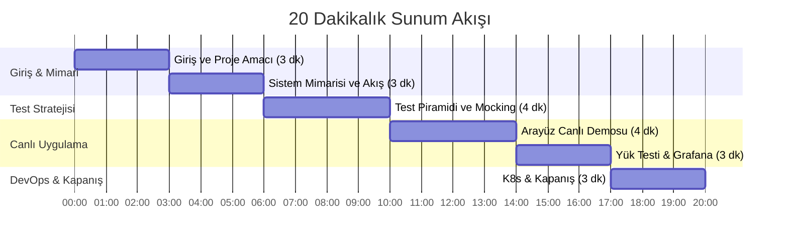

# ⏱️ 20 Dakikalık Sunum Yol Haritası ve Konuşma Planı

Bu dosya, sunumunuzu 20 dakikaya yayarak heyecanlanmadan, akıcı ve profesyonel bir şekilde aktarmanız için dakika dakika planlanmıştır. 

---

## ⏱️ Dakika Dakika Sunum Planı



---

### 🎤 1. Bölüm: Giriş ve Proje Amacı (00:00 - 03:00)
* **Ne Yapın:** Projenin slaytını veya tarayıcıda API ana sayfasını (`http://localhost:8000`) açın.
* **Ne Söyleyin:** 
  > *"Hocam merhaba. Bugün size 'Bulut Mimarilerinde Test Mühendisliği' dersi için geliştirdiğim 'Resim Boyutlandırma Mikroservisi' projesini sunacağım. Günümüzde e-ticaret siteleri, sosyal medya uygulamaları gibi sistemler milyonlarca resim yüklemesi alıyor. Bunları sunucu tarafında en-boy oranını bozmadan doğru boyutlandırmak ve güvenli bir şekilde bulutta depolamak çok kritik. Ben bu projede sadece çalışan bir kod yazmadım; uygulamanın bulut ortamındaki güvenilirliğini, test otomasyonunu, yük altındaki davranışını ve metrik takibini uçtan uca kurguladım."*

---

### 💻 2. Bölüm: Sistem Mimarisi ve Bulut Standartları (03:00 - 06:00)
* **Ne Yapın:** `README.md` dosyasındaki Mermaid mimari diyagramını ekrana yansıtın.
* **Ne Anlatın:**
  * **FastAPI + Pillow:** Hızlı ve asenkron resim işleme altyapısı.
  * **Bounding Box Standartı:** *"Hocam, resimleri boyutlandırırken en-boy oranını koruyan 'Bounding Box' prensibini kullandık. Resimlerimizin sünmesini önlemek için Pillow'un `thumbnail` fonksiyonundan yararlandık."*
  * **Bulut Depolama (S3) & Güvenlik:** *"Dosyaları S3 kovasında depoluyoruz. Güvenlik açığı (Path Traversal) oluşmaması için dosya adlarını rastgele UUID'lere çeviriyoruz. Ayrıca resimleri doğrudan dışa açmak yerine, sadece 1 saat geçerli olan 'Presigned URL' yapısını entegre ettik."*
  * **Veritabanı:** Metadata kayıtları için SQLAlchemy ORM katmanı ile SQLite ve PostgreSQL entegrasyonu sağladık.

---

### 🧪 3. Bölüm: Test Otomasyonu ve Test Piramidi (06:00 - 10:00)
* **Ne Yapın:** VS Code'da `tests/` klasörünü açıp genel yapıyı gösterin.
* **Ne Anlatın:**
  * **Test Piramidi:** *"Hocam projede test piramidini uyguladık. En altta birim testler, ortada entegrasyon testleri ve en üstte tarayıcı seviyesinde E2E testler var."*
  * **Birim Testleri (`tests/unit/`):** Pillow'un boyutlandırma algoritmaları ve Pydantic girdi sınırlandırmalarını nasıl test ettiğinizi anlatın.
  * **Mocking vs Emulation (`tests/integration/`):** *"Entegrasyon testlerinde gerçek AWS'ye bağlanmamak için **`moto`** kütüphanesini kullandık. Moto, AWS S3 servisini bellek içi (RAM) simüle ederek testlerin internet bağımsız ve ücretsiz çalışmasını sağlıyor. Yerel çalışırken ise Docker'da **`LocalStack`** emülatörü kullanıyoruz."*
  * **Uçtan Uca Testler (`tests/e2e/`):** *"Arayüz testleri için **Playwright** kullandık. Playwright arka planda gerçek bir Chromium tarayıcısı açıp butona basma, yükleme ve silme senaryolarını test ediyor."*
  * **Test Coverage:** Terminalden testi çalıştırıp **%80.97** kapsama raporunu hocaya gösterin.

---

### 🚀 4. Bölüm: Canlı Demo (Arayüz Testi) (10:00 - 14:00)
* **Ne Yapın:** `http://localhost:8000` adresindeki web arayüzünü açın.
* **Canlı Demo Adımları:**
  1. Bilgisayarınızdan bir görsel seçin (tercihen kare olmayan dikdörtgen bir görsel).
  2. Ölçüleri girin (Örn: En: 300, Boy: 500, Kalite: 85).
  3. "Resize & Upload" butonuna basın.
  4. Resmin orantılı şekilde boyutlandığını, en-boy oranının korunduğunu gösterin.
  5. İndirme butonuna basıp resmi indirin (browser'da `localhost:4566` ile indiğini gösterin).
  6. Silme butonuna basarak veritabanından ve S3'ten tamamen temizlendiğini kanıtlayın.

---

### 📊 5. Bölüm: Yük Testi ve Gözlemlenebilirlik (14:00 - 17:00)
* **Ne Yapın:** Bir yanda terminali, diğer yanda Grafana (`http://localhost:13000`) panelinizi yan yana açın.
* **Canlı Demo Adımları:**
  1. Terminalden k6 yük testi komutunu çalıştırın:
     ```bash
     docker run --rm -v $(pwd):/app -w /app --network=host grafana/k6 run performance/k6_script.js
     ```
  2. Grafana ekranına dönün ve otomatik yenileme (5s) açıkken grafiklerin nasıl tırmanmaya başladığını hocaya gösterin.
  3. **Yorumlayın:** *"Hocam şu an 50 sanal kullanıcı sisteme saniyeler içinde 1500 adet resim yükleme ve boyutlandırma isteği gönderiyor. Grafana üzerinden sistemin yanıt sürelerini (latency) ve istek sıklığını (request rate) anlık olarak izleyebiliyoruz. Bu yapıya 'Gözlemlenebilirlik' (Observability) diyoruz."*
  4. Prometheus'a (`http://localhost:9090`) gidip **Status -> Targets** ekranından uygulamamızın durumunun `UP` olduğunu gösterin.

---

### ☸️ 6. Bölüm: DevOps, Altyapı ve Kapanış (17:00 - 20:00)
* **Ne Yapın:** `k8s/` klasöründeki Kubernetes manifestlerini ve `Dockerfile`'ı gösterin.
* **Ne Anlatın:**
  * **Multi-stage Dockerfile:** Derleme ve çalışma ortamlarını ayırarak hafif ve güvenli bir Docker imajı ürettiğinizi anlatın.
  * **Kubernetes (Minikube):** Canlı ortamda uygulamanın nasıl ölçekleneceğini, deployment ve service dosyalarını hazırladığınızı gösterin.
  * **CI/CD Pipeline (GitHub Actions):** Kod her push'landığında testlerin otomatik koştuğunu belirtin.
* **Kapanış:** Soruları almak için hazırsınız!

---

## 🙋‍♂️ Muhtemel Hoca Soruları ve Cevap Hazırlığı

* **Soru: Unit testler ile Integration testlerin farkı nedir?**
  * *Cevap:* *"Birim testlerde veritabanı veya S3 bağlantısı yoktur hocam. Sadece algoritmalarımızı ve girdi parametrelerimizin doğruluğunu test ederiz. Entegrasyon testlerinde ise bu servisleri taklit ederek (mocking) aralarındaki iletişimin doğruluğunu test ederiz."*

* **Soru: Neden unit testlerde LocalStack yerine Moto kullandın?**
  * *Cevap:* *"LocalStack bir konteyner olarak çalışır ve ayağa kalkması/cevap vermesi vakit alır. Moto ise tamamen Python bellek alanında (RAM) çalıştığı için testlerimiz saniyeler içinde biter. Bu da yazılım geliştirme sürecini (feedback loop) hızlandırır."*

* **Soru: Resim boyutlandırırken neden en-boy oranını bozmadın?**
  * *Cevap:* *"Görsellerin esneyerek bozulmasını (distortion) önlemek için hocam. Endüstri standardı olan Bounding Box (sınır kutusu) yöntemini kullandık. Resimler hiçbir zaman deforme olmaz, sadece belirtilen kutunun içine sığacak şekilde orantılı küçültülür."*

* **Soru: AWS'yi nasıl göreceğiz? S3'te dosyaların gerçekten durduğunu nasıl kanıtlayabilirsin?**
  * *Cevap:* *"Hocam, biz yerelde AWS S3 simülasyonu olarak LocalStack kullandığımız için, normal AWS komut satırı aracı (AWS CLI) ile doğrudan bu yerel buluta bağlanıp dosyaları sorgulayabiliriz. Bunun için hiçbir ek kurulum gerekmeden resmi `aws-cli` Docker imajını kullanarak şu komutla S3'teki dosyaları listeleyebilirim:
  Hocam, LocalStack yerel olarak tam uyumlu bir AWS S3 API'si sunduğu için, resmi AWS CLI aracıyla sanki gerçek buluta bağlanır gibi bağlanıp S3 kovasının (bucket) içeriğini doğrudan listeleyebiliyoruz."*
  * *Komut:*
    ```bash
    docker run --rm -e AWS_ACCESS_KEY_ID=test -e AWS_SECRET_ACCESS_KEY=test -e AWS_DEFAULT_REGION=us-east-1 --network=host amazon/aws-cli --endpoint-url=http://localhost:4566 s3 ls s3://image-resize-bucket/resized/
    ```
